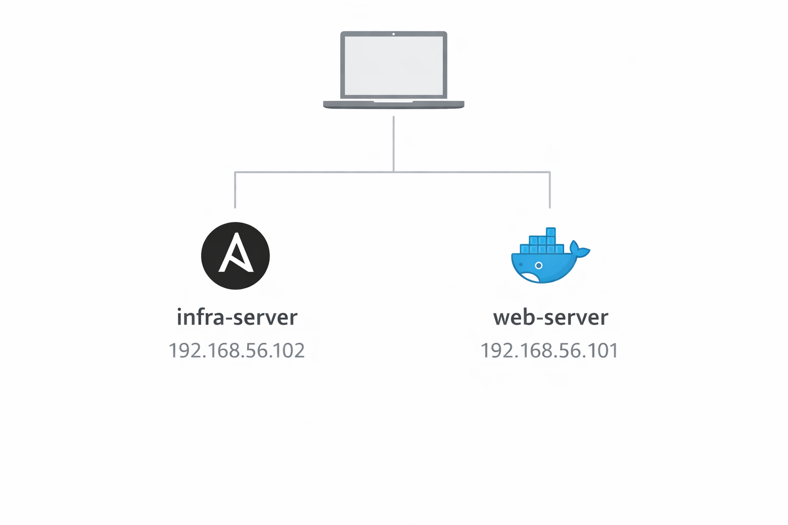

# Laboratorio Servidores

Este projeto é um **laboratório simples de infraestrutura** criado para praticar conceitos básicos de **Linux, redes, automação e containers**, comuns em ambientes DevOps.

O ambiente foi construído utilizando **máquinas virtuais** para simular dois servidores que se comunicam entre si dentro de uma rede privada. O objetivo é entender na prática como servidores podem ser configurados, conectados em rede e gerenciados remotamente.

Este projeto faz parte do meu processo de começo aprendizado em infraestrutura, DevOps e administração de sistemas, áreas pelas quais tenho grande interesse.

---

# Objetivo do Projeto

O principal objetivo deste projeto é praticar habilidades importantes e aprender para quem está começando na área de infraestrutura ou DevOps, como:

- criação e configuração de servidores Linux
- uso de máquinas virtuais
- configuração de rede entre servidores
- acesso remoto entre máquinas
- automação básica de tarefas
- execução de aplicações em containers

Esse tipo de ambiente simula, de forma simples, uma infraestrutura utilizada em empresas de tecnologia.

---

# Estrutura do Laboratório

O laboratório possui **dois servidores virtuais**, cada um com uma função 

### Web Server

Este servidor representa um servidor de aplicações, para rodar tudo.

Nele são executados os **containers** do Docker, que simulam serviços rodando em um ambiente de servidor real. Esse servidor é responsável por hospedar as aplicações.

### Infra Server

Este servidor é utilizado para **gerenciar e automatizar tarefas** com o Ansible em outros servidores.

A partir dele é possível acessar outras máquinas da rede e executar comandos remotamente, simulando tarefas comuns de administração de infraestrutura.

---

# Rede do Projeto

As máquinas virtuais foram configuradas com duas redes:

**Rede com acesso à internet**

Permite que os servidores instalem programas, atualizações e dependências necessárias para o funcionamento do sistema.

**Rede privada entre as máquinas**

Permite a comunicação direta entre os servidores do laboratório, simulando uma rede interna de infraestrutura como as utilizadas em empresas ou data centers.

---

# Tecnologias Utilizadas

Durante o desenvolvimento deste projeto foram utilizadas algumas ferramentas importantes utilizadas em ambientes de infraestrutura moderna.

**Linux (Ubuntu Server)**  
Sistema operacional utilizado nos servidores.

**VirtualBox**  
Ferramenta utilizada para criar e executar as máquinas virtuais.

**Docker**  
Tecnologia utilizada para executar aplicações em containers.

**Ansible**  
Ferramenta utilizada para automação e gerenciamento remoto de servidores.

**SSH**  
Protocolo utilizado para acesso remoto seguro entre máquinas.

---

# Estrutura do Projeto

infra-lab
│
├── README.md
│
├── docs
│ ├── setup.md
│ ├── servers.md
│ └── network.md
│
├── diagrams
│ └── network-diagram.png
│
└── screenshots

